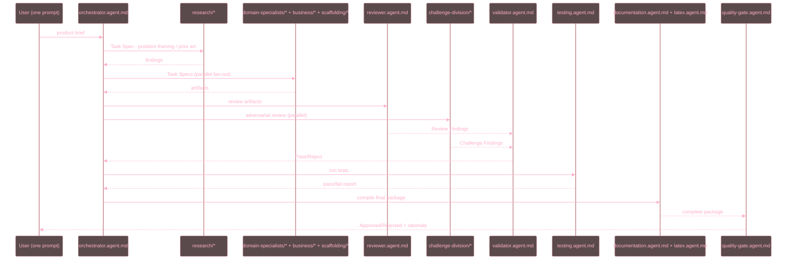

# Engineering Studio AI — Agent Roster

## Table of Contents

- [Purpose](#purpose)
- [Relationship to other standards files](#relationship-to-other-standards-files)
- [Roster](#roster)
- [Pipeline order](#pipeline-order)
- [Changelog](#changelog)

## Purpose

WHAT: This directory deploys a curated, hackathon-scoped subset of the
CodingStandardsRef MDAP agent catalog (`prompts/agents/mdap/`) as concrete,
selectable custom agents for this repository, matching the role mapping in
`markdowns/visions/VISION_AMD_LABLAB_HACKATHON_ENGINEERING_STUDIO.md` §4.
WHY: The hackathon "Engineering Studio AI" demo needs a working, in-repo
agent roster — not just a reference to the private parent catalog — while
this repo remains a public spin-off (per repo memory
`vision-docs-conventions.md`, "AMD Hackathon public repo spin-off" section).
HOW: Every file here is a condensed, original restatement (never a verbatim
copy) of its corresponding `mdap-*` source file, cross-linking
`STANDARDS_SUMMARY.md` and the repo-root `AGENTS.md` instead of re-deriving
standards content.

## Relationship to other standards files

- `AGENTS.md` (repo root) — condensed SOLID/ACID/SCOPE/grounding/injection/
  token-efficiency/aesthetics/logging/security/SemVer baseline for this repo.
- `STANDARDS_SUMMARY.md` (this directory) — companion covering JPL
  Power-of-Ten, ARIA/accessibility, strict enumeration, testing taxonomy,
  project scaffolding, virtual environments, UI/UX, and documentation
  structure (the standards not already in `AGENTS.md`).
- `prompts/agents/mdap/` (CodingStandardsRef submodule, private-corpus-
  adjacent parent catalog) — the ~250-role source catalog this roster is
  curated from. Not copied verbatim into this public repo.

## Roster

| Path | Role |
| :--- | :--- |
| `orchestrator.agent.md` | Decomposes the product brief, dispatches, collects |
| `research/` | General / Subject-Domain / Problem-Analysis research |
| `domain-specialists/` | Mechanical / Electrical / Systems Engineering |
| `business/` | Cost-Business / Legal-Compliance |
| `scaffolding/` | Project Scaffolding / Python Scaffolding |
| `reviewer.agent.md` | Read-only critique against acceptance criteria |
| `challenge-division/` | Security / Failure-Analysis / Safety / Red-Team / Paranoid-Devil's-Advocate / Cost-Sustainability / Project-Prosecutor |
| `validator.agent.md` | Cross-artifact consistency join point |
| `testing.agent.md` | Unit/integration/contract test execution |
| `documentation.agent.md` | Final package compilation |
| `latex.agent.md` | Math-notation / LaTeX-compile correctness |
| `quality-gate.agent.md` | Final Approved/Rejected verdict |
| `guardrails/` | Grounding-Drift / Prompt-Injection / Token-Efficiency (always-on) |

## Pipeline order

## Changelog

| Version | Date       | Author     | Description                                                                 |
| :------ | :--------- | :--------- | :------------------------------------------------------------------------------|
| 0.1.0   | 2026-07-06 | Hadrian Hu | Initial deployment: curated ~30-file roster matching `VISION_AMD_LABLAB_HACKATHON_ENGINEERING_STUDIO.md` §4, plus `STANDARDS_SUMMARY.md`. |
| 0.2.0   | 2026-07-10 | Hadrian Hu | Themed the Pipeline order Mermaid `sequenceDiagram` with the Variant B (interface-surface) palette per `coding_stds/visualization/aesthetic_standards.txt` §1.2.3 and `src/engineering_studio/utils/palette.py`. |
