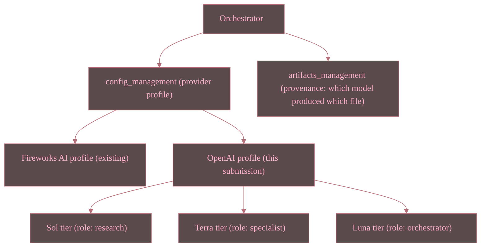

<!--
WHAT: A SEPARATE, narrow-scope entry point for OpenAI Hackathon judges —
does not replace or edit README.md or docs/JUDGES_GUIDE.md, which remain
the AMD LabLabAI Hackathon's own judges' materials.
WHY: This repo now serves two hackathon submissions from one codebase.
An OpenAI judge should never have to filter AMD-specific framing out of
their own entry point.
HOW: Mirrors docs/JUDGES_GUIDE.md's structure (30-second summary, fastest
paths to see it run, links to evidence) but scoped to only the OpenAI
provider profile and the narrow set of new agents/surfaces this pivot
adds. Kept current as PLAN.md's phases land — see its own Changelog.
-->

# README (OpenAI Hackathon Judges) — Engineering Studio AI

**Status: in progress.** This document is authored ahead of the
implementation work it describes (see `INVESTIGATE.md`, `PREPLAN.md`,
`PLAN.md`, `PROMPT.md` at repo root). Sections marked *(pending)* will be
completed as `PLAN.md`'s phases are executed — this file is not yet a
claim that those phases are done.

## 1. What this submission adds, in 30 seconds

The base Engineering Studio AI pipeline (multi-agent, one product brief
in -> full engineering package out) is unchanged and already documented
for the AMD LabLabAI Hackathon (see root `README.md`). This submission's
narrow, additive contribution is:

1. A second, OpenAI-provider model-routing profile alongside the
   existing Fireworks AI one (config-only swap — see `INVESTIGATE.md` §4),
   intended to exercise GPT-tier models across the same pipeline stages.
2. A small set of new, finer-grained specialist agents
   (`.github/agents/{domain-specialists/*, artifacts_management, config_management, software_supply_chain, testing}/`) increasing the
   number of individually-verifiable model calls a single demo run makes.
3. Narrow, additive surfacing of *which* model answered *which* stage
   across the API, web UI, CLI, and TUI (`INVESTIGATE.md` §5) — so a
   judge can visibly confirm GPT-tier usage rather than take it on faith.

## 2. What this submission explicitly does NOT change

- The AMD LabLabAI Hackathon judges' materials (`README.md`,
  `docs/JUDGES_GUIDE.md`, `paper/`, `presentation/`) are unmodified.
- Fireworks AI support is not removed; both providers coexist.
- No physical hardware fabrication is claimed anywhere in this repo —
  "hardware" work remains simulation/emulation-only, same disclosed
  assumption as the AMD submission.

## 2a. Implementation status (updated as PLAN.md phases land)

As of 2026-07-18: `PLAN.md` Phases 1, 3, 5, 6, and 7 are complete — all
12 previously-empty `.github/agents/` subdirectories now contain one or
more fine-grained specialist agent files (21 new files total), each
cross-linked from its umbrella parent flat file rather than duplicating
it, plus the `OPENAI_*` env-var block in `.env.example` (Phase 2). Phase
4 (SDK/API/CLI/TUI provider-swap code + tests) and Phase 8/9 (Playwright
evidence, deployment re-verification) remain pending — gated on
confirming real OpenAI model IDs (§3) before any code references a
literal model string.

## 3. Model naming disclosure (read this before judging model usage)

At the time this document was authored, the exact OpenAI API model
identifiers for the hackathon's named tiers ("GPT-5.6 Sol / Terra /
Luna") had not yet been confirmed against this repo's own configuration.
Per this project's grounding rule (`AGENTS.md` §5 — never fabricate),
`.env.example` and `config_management/` document the **shape** of the
provider profile (three role-scoped model env vars, mirroring the
existing Fireworks 3-way split) with real values to be filled in once
confirmed, rather than a placeholder or fabricated model string being
presented as if it were live. See `INVESTIGATE.md` §4 for the full
disclosure.

## 4. See it run *(pending — filled in once PLAN.md Phase 4/8 complete)*

| Path                           | Command       | Notes                                                                                              |
| :----------------------------- | :------------ | :------------------------------------------------------------------------------------------------- |
| Live, native (OpenAI provider) | *(pending)* | Requires`OPENAI_API_KEY` + confirmed model IDs in `.env`.                                      |
| Recorded evidence              | *(pending)* | Playwright screenshots/video, see`docs/E2E_EVIDENCE.md` once Task 4/5 of `PROMPT.md` complete. |

## 5. Architecture delta vs. the AMD submission

*(Tier-to-role mapping above is this submission's proposed default per
`PREPLAN.md` Q1/Q3 — confirm against the hackathon's actual kickoff
materials before treating it as final.)*

## 6. Evidence index

| Artifact                     | Link                                                                                                          | Status                             |
| :---------------------------- | :--------------------------------------------------------------------------------------------------------------------------- | :--------------------------------- |
| Investigation report         | [../INVESTIGATE.md](INVESTIGATE.md)                                                                            | Complete                           |
| Preplan                      | [../PREPLAN.md](PREPLAN.md)                                                                                    | Complete                           |
| Implementation plan          | [../PLAN.md](PLAN.md)                                                                                          | Complete                           |
| Execution task specs         | [../PROMPT.md](PROMPT.md)                                                                                      | Complete                           |
| New agent roster additions   | `.github/agents/{domain-specialists,artifacts_management,config_management,software_supply_chain,testing}/` | Complete (PLAN.md Phases 1, 3, 5-7 — 21 new agent files + `.env.example` OpenAI block, 2026-07-18) |
| SDK/API/CLI/TUI provider-swap additions | `src/engineering_studio/{sdk,api,cli,gui}/` | Pending (PLAN.md Phase 4 — gated on real OpenAI model IDs, see §3) |
| Playwright screenshots/video | `docs/E2E_EVIDENCE.md` (new row)                                                                            | Pending (PROMPT.md Task 4-5)       |
| Deployment re-verification   | `docs/E2E_EVIDENCE.md` (new row)                                                                            | Pending (PROMPT.md Task 6)         |

## Changelog

| Version    | Date       | Author     | Description                                                                                                                                  |
| :--------- | :--------- | :--------- | :------------------------------------------------------------------------------------------------------------------------------------------- |
| 2026.0.1.0 | 2026-07-17 | Hadrian Hu | Initial narrow-scope OpenAI judges' entry point, authored alongside INVESTIGATE/PREPLAN/PLAN/PROMPT; implementation sections marked pending. |
