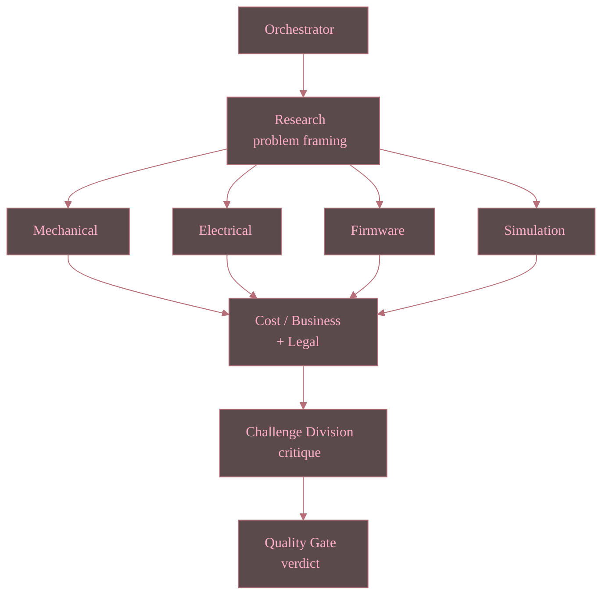

<!--
WHAT: A single, self-contained entry point for hackathon judges — what the
project is, how to see it run, and links to every artifact of interest
(paper, slides, screenshots, videos, live evidence).
WHY: Judges have limited review time; scattering the paper/slides/demo
across README.md, paper/, presentation/, and docs/E2E_EVIDENCE.md forces
them to hunt. This file exists solely so a judge can start here and reach
everything else in one or two clicks — it does not replace those files.
HOW: Kept in sync manually whenever a new demo asset lands; see
`docs/RESPONSIBILITIES.md` for the owning role and update cadence.
-->

# Judges' Guide — Engineering Studio AI

**AMD LabLabAI Hackathon — Act II — Track 3 (Unicorn/Startup) submission.**

## 1. What this project is, in 30 seconds

Type one product brief (e.g. *"Design a warehouse robot"*) and a team of
AI specialist agents — Research, Mechanical, Electrical, Firmware,
Simulation, Cost/Business, Legal, a Challenge Division, and a Quality
Gate — collaborate over Fireworks AI-hosted open models (or via other cloud models) to produce a
complete engineering package (BOM, wiring/power notes, firmware
skeleton, emulation-only simulation config, cost estimate, documentation
export) in one run, visible live in a browser dashboard.

## 2. See it run — fastest paths

| Path                                   | Command                                                                                       | Notes                                                                                                                                                     |
| -------------------------------------- | --------------------------------------------------------------------------------------------- | --------------------------------------------------------------------------------------------------------------------------------------------------------- |
| **Recorded evidence (no setup)** | Open any file in[§4](#4-recorded-demo-evidence-screenshots--video)                            | Zero install, exact frames/clips from a real run.                                                                                                         |
| **Live, native**                 | See[../README.md](../README.md#quick-start) Quick Start                                        | Needs a`FIREWORKS_API_KEY` for a real (non-mocked) run.                                                                                                 |
| **Live, Docker**                 | `docker compose -f ../deployment/docker-compose.yml up` then open `http://localhost:8000` | One container, dashboard surface; see[../deployment/README.md](../deployment/README.md). Build+run verified 2026-07-10 (`{"status":"ok"}` health check). |

## 3. Formal write-ups

| Artifact                   | Link                                                                                                                          | Contents                                                                                                                                   |
| -------------------------- | ----------------------------------------------------------------------------------------------------------------------------- | ------------------------------------------------------------------------------------------------------------------------------------------ |
| Public whitepaper (short)  | [../paper/engineering_studio_ai_whitepaper_for_team_public.pdf](../paper/engineering_studio_ai_whitepaper_for_team_public.pdf) | Distilled, judge-friendly summary of the architecture and results.                                                                         |
| Full paper (formal proofs) | [../paper/engineering_studio_ai_paper.pdf](../paper/engineering_studio_ai_paper.pdf)                                           | Full mathematical model: acyclicity, bounded rework termination, minimum agent multiplicity, trust-tier safety, cost convergence sketch.   |
| Slide deck                 | [../presentation/slides.html](../presentation/slides.html)                                                                     | Self-contained HTML deck — open directly in any browser, arrow keys to navigate.                                                          |
| Slide deck (PNG stills)    | [../presentation/slides_png/](../presentation/slides_png/)                                                                     | All 9 slides pre-rendered to PNG (regenerate via`../presentation/export_slides_to_png.py`) — view inline without opening the HTML deck. |
| ↳ Architecture slide      | [../presentation/slides_png/04-architecture.png](../presentation/slides_png/04-architecture.png)                               | The Orchestrator → Parallel Specialists → Quality Gate Mermaid diagram, single slide of interest for judges short on time.               |
| Slide outline              | [../presentation/slides-outline.md](../presentation/slides-outline.md)                                                         | Slide-by-slide content plan behind the deck above.                                                                                         |

> Note: both PDFs are tracked via Git LFS (see [../paper/README.md](../paper/README.md)). If you cloned without LFS support you may see a small pointer file instead of the PDF — use `git lfs pull` or download via the GitHub web UI.

## 4. Recorded demo evidence (screenshots + video)

All evidence below was captured from **real runs** of the actual FastAPI +
SSE + vanilla-JS dashboard (Playwright-driven, Mode B —
`ENGINEERING_STUDIO_FAKE_PIPELINE=1`, i.e. deterministic/CI-safe — see
[E2E_EVIDENCE.md](E2E_EVIDENCE.md)), across 3 sample prompts and both
supported color variants (Variant A "light" pink/black, Variant B "dark"
black/pink), 10 pipeline stages each.

- **Screenshots** (30 total, 10 stages × 3 prompts, per variant):
  [../demo/recordings/screenshots/light/](../demo/recordings/screenshots/light/) ·
  [../demo/recordings/screenshots/dark/](../demo/recordings/screenshots/dark/)
  Stage sequence per prompt: `empty → research → mechanical → electrical → firmware → simulation → business → challenge → quality_gate → final`.
- **Video** (3 clips per variant, one per sample prompt):
  [../demo/recordings/video/light/](../demo/recordings/video/light/) ·
  [../demo/recordings/video/dark/](../demo/recordings/video/dark/)
  (Playwright auto-names these `page@<hash>.webm`; open any one — all
  three per variant show a full run end to end.)

## 5. Test & security evidence (verified today, 2026-07-10)

See [E2E_EVIDENCE.md](E2E_EVIDENCE.md) for the full table. Summary:

- **111 unit/integration tests passed**, **100.00% statement coverage** (640/640).
- **17 end-to-end (Playwright) tests passed**, 0 failed, 0 errors.
- **ruff**, **mypy --strict**, **bandit -ll**, **pip-audit** all clean (0 issues).
- **Docker build + container smoke test**: image built, container started, `GET /api/health` → `{"status":"ok"}`.

## 6. Architecture at a glance

<!-- Mermaid Variant B (interface-surface) theming per
coding_stds/visualization/aesthetic_standards.txt §1.2.3, palette values
sourced from src/engineering_studio/utils/palette.py PALETTE_B_*
(background/muted/foreground-primary/accent) — kept identical to the
README.md copy of this diagram; update both together. -->

Every specialist agent is reachable from **every** runnable surface —
CLI (`engineering_studio.cli`), GUI (`engineering_studio.gui`, Textual
TUI), API/webapp dashboard (FastAPI + SSE), and the Python SDK (importing
`engineering_studio` directly) — not just the browser demo. See
[../README.md](../README.md#architecture) and [AGENTS.md](../AGENTS.md)
for the full scope-control contract each agent operates under.

## 7. Where to go for more detail

| Question                                               | See                                                                                    |
| ------------------------------------------------------ | -------------------------------------------------------------------------------------- |
| "How do I run this myself?"                            | [../README.md](../README.md)                                                            |
| "What's the full track rationale / business case?"     | `VISION_AMD_LABLAB_HACKATHON_ENGINEERING_STUDIO.md` (private repo, team access only) |
| "What are the coding/security standards this follows?" | [../AGENTS.md](../AGENTS.md)                                                            |
| "What's the exact test/coverage evidence?"             | [E2E_EVIDENCE.md](E2E_EVIDENCE.md)                                                      |
| "Who owns what part of the repo?"                      | [RESPONSIBILITIES.md](RESPONSIBILITIES.md)                                              |
| "How is deployment/Docker set up?"                     | [../deployment/README.md](../deployment/README.md)                                      |

## Changelog

| Version    | Date       | Author     | Description                                                                                                                                                                                                                                     |
| :--------- | :--------- | :--------- | :---------------------------------------------------------------------------------------------------------------------------------------------------------------------------------------------------------------------------------------------- |
| 2026.1.0.0 | 2026-07-10 | Hadrian Hu | Initial judges' guide, created as a standalone entry point per final-sprint-readiness PLAN step S4.                                                                                                                                             |
| 2026.1.1.0 | 2026-07-10 | Hadrian Hu | Converted §6 architecture ASCII diagram to a Mermaid`flowchart TD`, themed with the Variant B (interface-surface) palette per `coding_stds/visualization/aesthetic_standards.txt` §1.2.3 and `src/engineering_studio/utils/palette.py`. |
