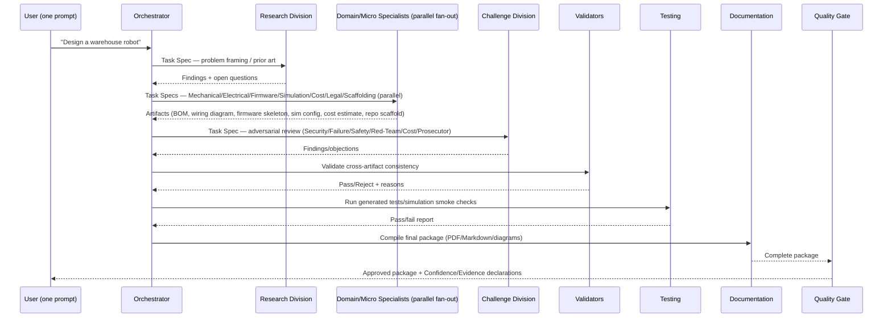

# VISION: AMD LabLabAI Hackathon — Engineering Studio AI

## Table of Contents

- [Abstract](#abstract)
- [Keywords](#keywords)
- [Executive Summary](#executive-summary)
- [1. Challenge Context](#1-challenge-context)
- [2. Candidate Tracks (selectable)](#2-candidate-tracks-selectable)
- [3. Flagship Track — Engineering Studio AI](#3-flagship-track--engineering-studio-ai)
- [4. MDAP Roster Mapping](#4-mdap-roster-mapping)
- [5. Demo Flow](#5-demo-flow)
- [Appendix A — Filled Task Specifications](#appendix-a--filled-task-specifications)
- [References](#references)
- [Changelog](#changelog)

## Abstract

This document prepares the CodingStandardsRef MDAP agent catalog (`prompts/agents/mdap/`) for use in the AMD Developer Hackathon (lablab.ai, Unicorn Track). It selects and elaborates the flagship track from `VISION_MULTIMODAL_AGENT_ENGINEERING.md`'s brainstormed idea list — **Engineering Studio AI** — as the "full engineering + corporate team" concept: a multi-agent system that takes one natural-language product brief and produces a complete engineering package (software, and where applicable hardware/firmware emulation) plus the business-side artifacts (cost, compliance, documentation) a real engineering organization would also produce. It also documents the other five brainstormed tracks as fallback/alternative options.

## Keywords

AMD, LabLabAI, hackathon, multi-agent orchestration, MDAP, Engineering Studio AI, hardware emulation, ROS2/Gazebo, judging-criteria mapping.

## Executive Summary

**Objective:** Prepare concrete, reusable Task Specification prompts (per `mdap-task-specification.prompt.md`) that wire the existing ~250-role MDAP catalog into a working hackathon demo, without inventing new infrastructure this document cannot verify exists (AMD GPU/ROCm specifics, Fireworks AI access, lablab.ai submission mechanics are **not** verified here — flagged as assumptions below).

**Approach:** Map the judging criteria (Creativity, Originality, Completeness, AMD-ecosystem usage, Startup potential) onto the MDAP Layer 0-8 + Challenge Division pipeline, then author filled Task Specifications for the flagship track's first pipeline pass.

**Outcome:** A `mdap-14-amd-lablab-hackathon-task-specs.md` companion file (in the `prompts` submodule) containing copy-paste-ready Task Specifications for Orchestrator decomposition, parallel Domain Specialist fan-out (Mechanical/Electrical/Firmware/Simulation/Business/Cost/Documentation), Challenge Division review, and Quality Gate sign-off.

**Recommendations:** Treat the "hardware" side as **emulation/simulation only** for the hackathon timebox (e.g. Gazebo/ROS2, SPICE-level circuit simulation, or a CAD-adjacent BOM/wiring description) rather than physical fabrication, since no physical hardware access is verified in this workspace.

**Assumptions (explicitly stated, not verified):**
1. AMD ROCm/GPU compute and Fireworks AI access are provisioned by the hackathon organizers, not this repository.
2. "Hardware emulation" means software simulation (Gazebo, SPICE, CAD/BOM generation), not physical fabrication.
3. The judging rubric described in `VISION_MULTIMODAL_AGENT_ENGINEERING.md` (Creativity/Originality/Completeness/AMD-usage/Startup-potential) is taken as given from that prior conversation, not independently re-fetched from lablab.ai in this session.

## 1. Challenge Context

Per `VISION_MULTIMODAL_AGENT_ENGINEERING.md` (attached), the AMD Developer Hackathon's Unicorn Track judges on Creativity, Originality, Completeness, effective AMD-infrastructure usage, and product/startup potential — rewarding a complete, memorable product demo over a single best-benchmark model call.

## 2. Candidate Tracks (selectable)

| # | Track | One-line pitch | Status this round |
| :--- | :--- | :--- | :--- |
| 1 | **Engineering Studio AI** | One prompt -> multiple specialist agents collaborate live -> exports a complete engineering package (software + hardware emulation + docs). | **Flagship — elaborated below.** |
| 2 | X Mark X Lite | AI resume/ATS optimization pipeline (multi-model compare, PDF/HTML/LaTeX export). | Documented as fallback; not elaborated further here (out of scope per this round's user selection). |
| 3 | Robotics Engineer Copilot | CAD/requirements/wiring/firmware in -> sensor/motor/CAN topology/BOM/PCB architecture out. | Folded into Engineering Studio AI's Mechanical/Electrical fan-out (§3). |
| 4 | Multi-Agent Engineering Review | Mechanical/electrical/software/safety/manufacturing/cost agents critique one design, manager agent produces consensus report. | Folded into Engineering Studio AI's Challenge Division pass (§3). |
| 5 | AI Digital Twin Builder | Factory description in -> simulation/bottleneck/energy/scheduling out. | Documented as fallback; not elaborated further here. |
| 6 | AI Incident Investigator | Logs/screenshots/contracts in -> timeline/entity-graph/report out. | Documented as fallback; not elaborated further here. |

Per the user's instruction ("moreso for final ultimate idea of agents to produce full products... like a full engineering and corporate team"), Track 1 is elaborated as the flagship; Tracks 2-6 remain selectable pivots if AMD-infrastructure constraints (compute quota, model availability) make Track 1's full scope infeasible within the hackathon timebox.

## 3. Flagship Track — Engineering Studio AI

**Pitch:** Type one prompt (e.g. "Design a warehouse robot"). The Orchestrator decomposes it; Mechanical, Electrical, Firmware, Simulation, Business/Cost, and Documentation agents run in parallel; the Challenge Division adversarially reviews the result; the Quality Gate renders a verdict; the demo exports a complete package (BOM, wiring/architecture diagram, firmware skeleton, simulation config, cost estimate, spec document) — a "full engineering AND corporate team" producing one complete product artifact set, not just code.

**Why this maps onto MDAP directly:** MDAP already has every role this pitch needs (see §4) — this track requires **zero new agent roles**, only Task Specifications that wire the existing catalog together for this specific demo.

## 4. MDAP Roster Mapping

| Demo Role (from the pitch) | MDAP File(s) Already In Catalog |
| :--- | :--- |
| Orchestrator (decompose the prompt) | `mdap-01-orchestrator.agent.md` |
| Problem framing / prior-art | `research/problem-analysis-research-micro-specialist.agent.md` (Round 4) |
| Mechanical Agent | `domain-specialists-industry/engineering/` (mechanical/aerospace-adjacent), `micro-specialists/aerospace/structures-materials-micro-specialist.agent.md` |
| Electrical Agent | `mdap-02-domain-specialist.agent.md` (electrical row), `micro-specialists/` electrical-adjacent files |
| Firmware Agent | `mdap-02-domain-specialist.agent.md` (firmware row) |
| Simulation Agent | Domain Specialist row 26 `simulations/` in `mdap-09-domain-specialists-extended.agent.md` |
| Robotics/Perception/Planning | `VISION` robotics rows (§1.2.3.5 in the taxonomy) — cite for any new Robotics Micro Specialist if one is added later; not created this round (out of the approved scope) |
| Cost/Business Agent | `domain-specialists-industry/disciplines/` business/finance/economics specialists (Round 3) |
| Legal/Compliance Agent | `domain-specialists-industry/disciplines/legal-specialist.agent.md` (Round 3) |
| Scaffolding of the generated repo | `micro-specialists/scaffolding/` (Round 4) — e.g. `cpp-scaffolding-micro-specialist.agent.md`, `microservices-scaffolding-micro-specialist.agent.md` |
| Documentation Agent | `mdap-06-documentation.agent.md` |
| Reviewers (per theme) | `mdap-04-reviewer.agent.md` + `reviewers/` splits |
| Challenge Division (adversarial) | `mdap-challenge-*.agent.md` + `challenge-division/` splits (Security, Failure Analysis, Safety, Red Team, Paranoid/Devil's Advocate, Cost/Sustainability, Project Prosecutor) |
| Validators | `mdap-05-validator.agent.md` |
| Testing | `mdap-07-testing.agent.md` + `testing/` splits |
| Quality Gate (final verdict) | `mdap-08-quality-gate.agent.md` |

## 5. Demo Flow

## Appendix A — Filled Task Specifications

See `prompts/agents/mdap/mdap-14-amd-lablab-hackathon-task-specs.md` for the copy-paste-ready, filled Task Specification prompts (Orchestrator decomposition pass + parallel fan-out + Challenge Division + Quality Gate) implementing the flow in §5.

## References

- `markdowns/visions/VISION_MULTIMODAL_AGENT_ENGINEERING.md` (source brainstorm/judging-criteria discussion, attached to this session).
- `prompts/agents/mdap/mdap-task-specification.prompt.md` (Task Specification template).
- `prompts/agents/mdap/mdap-13-extension-pack-round4-index.md` (Research Division + Scaffolding Division used by this track).

## Changelog

| Version | Date | Author | Description |
| :--- | :--- | :--- | :--- |
| 2026.1.0.0 | 2026-07-04 | Hadrian Hu | Initial creation. |
